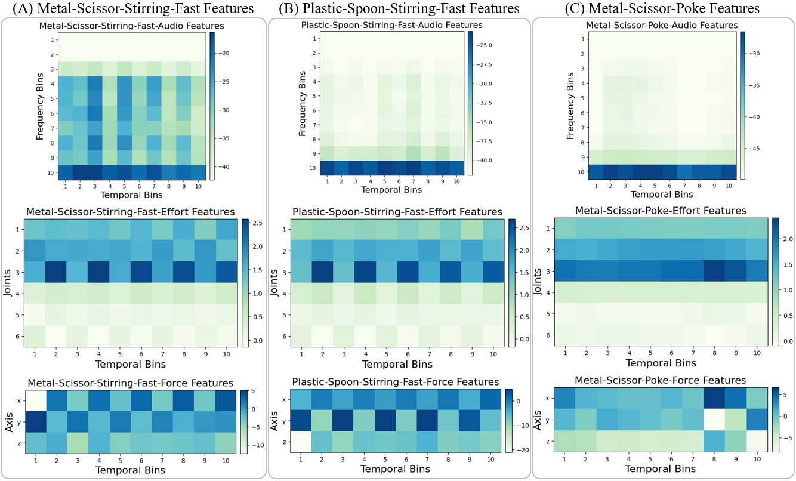

# Cross-Tool and Cross-Behavior Perceptual Knowledge Transfer for Grounded Object Recognition

**Abstract:**

> Humans learn about objects via interaction and using multiple perceptions, such as vision, sound, and touch.
While vision can provide information about an object's appearance, non-visual sensors, such as audio and haptics, can provide information about its intrinsic properties, such as weight, temperature, hardness, and the object's sound.
Using tools to interact with objects can reveal additional object properties that are otherwise hidden (e.g., knives and spoons can be used to examine the properties of food, including its texture and consistency.)
Robots can use tools to interact with objects and gather information about their implicit properties via non-visual sensors.
However, a robot's model for recognizing objects using a tool-mediated behavior does not generalize to a new tool or behavior due to differing observed data distributions.
To address this challenge, we propose a framework to enable robots to transfer implicit knowledge about granular objects across different tools and behaviors.
The proposed approach learns a shared latent space from multiple robots' contexts produced by respective sensory data while interacting with objects using tools.
We collected a dataset using a UR5 robot that performed 5,400 interactions using 6 tools and 6 behaviors on 15 granular objects and tested our method on cross-tool and cross-behavioral transfer tasks.
Our results show the less experienced target robot can benefit from the experience gained from the source robot and perform recognition on a set of novel objects.
We have released the code, datasets, and additional results: https://github.com/gtatiya/Tool-Knowledge-Transfer.

## Installation

`Python 3.10` and `MATLAB R2022b` are used for development.

```
pip install -r requirements.txt
```

### MATLAB

[Install MATLAB Engine API for Python](https://www.mathworks.com/help/matlab/matlab_external/install-the-matlab-engine-for-python.html) <br>
MATLAB Dependencies: Statistics and Machine Learning Toolbox

## Dataset

- [Download the dataset](https://tufts.box.com/s/e22rlxx3tatmgjvkp1e4xdo10jnhb79v)
- Dataset details can be found on the [dataset webpage](https://www.eecs.tufts.edu/~gtatiya/pages/2023/UR5_Tool_Dataset.html).

### Discretized Representation

- [Visualization of discretized modalities](DatasetVisualization.ipynb) <br>
- 

### Dataset Collection


UR5: https://youtu.be/0-tLtI16X2U <br>


## How to run the code?

### Transfer robot knowledge

```
python transfer_robot_knowledge.py -across <TRANSFER TASK> -augment-trials <NO. OF TRIALS> -classifier-name <CLASSIFIER> -num-folds <NO. OF FOLDS> -increment-train-objects
```
Example:
```
python transfer_robot_knowledge.py -across tools -augment-trials 10 -classifier-name SVM-RBF -num-folds 10 -increment-train-objects
```

## Results

### Illustrative Example


### Accuracy Results of Object Recognition

#### Cross-tool sensorimotor transfer


#### Cross-behavioral sensorimotor transfer


### Accuracy Delta Results

#### Cross-tool sensorimotor transfer

<table>
<tbody>
<tr>
<td></td>
<td></td>
</tr>
<tr>
<td></td>
<td></td>
</tr>
<tr>
<td></td>
<td></td>
</tr>
</tbody>
</table>

#### Cross-behavioral sensorimotor transfer

<table>
<tbody>
<tr>
<td></td>
<td></td>
</tr>
<tr>
<td></td>
<td></td>
</tr>
<tr>
<td></td>
<td></td>
</tr>
</tbody>
</table>

### Tools and Behaviors Transfer Relationships


